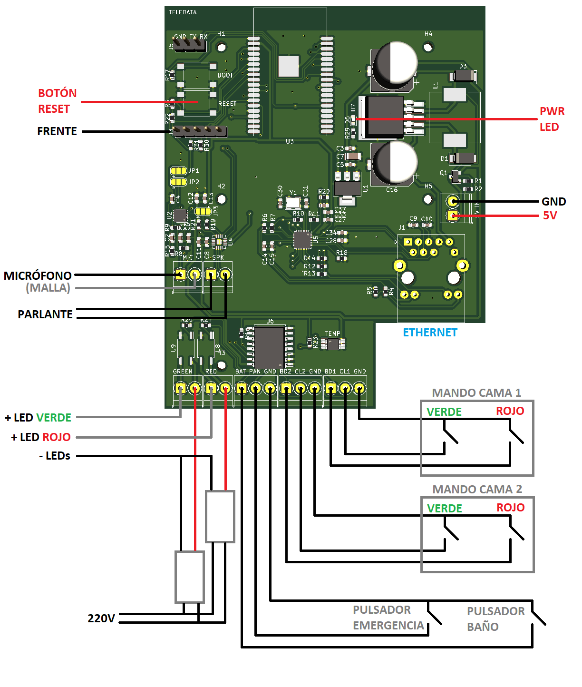
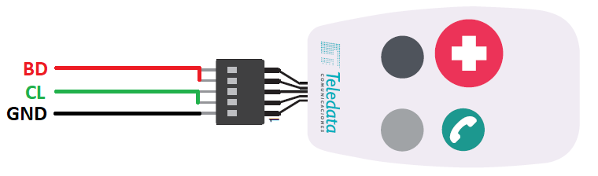
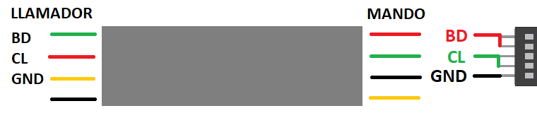
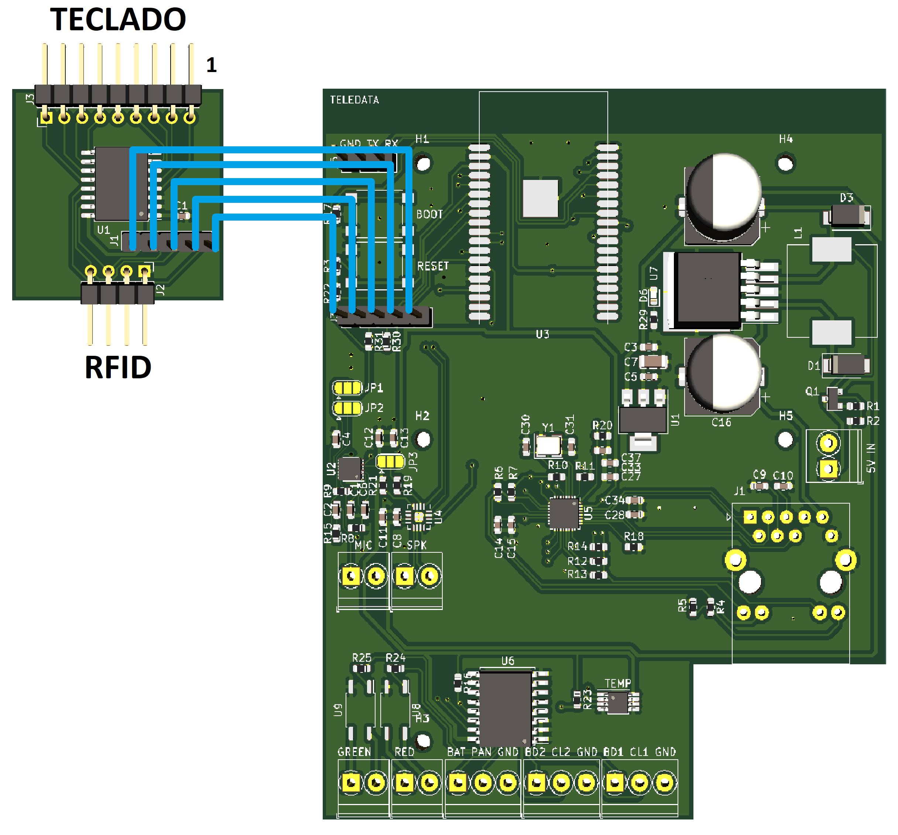
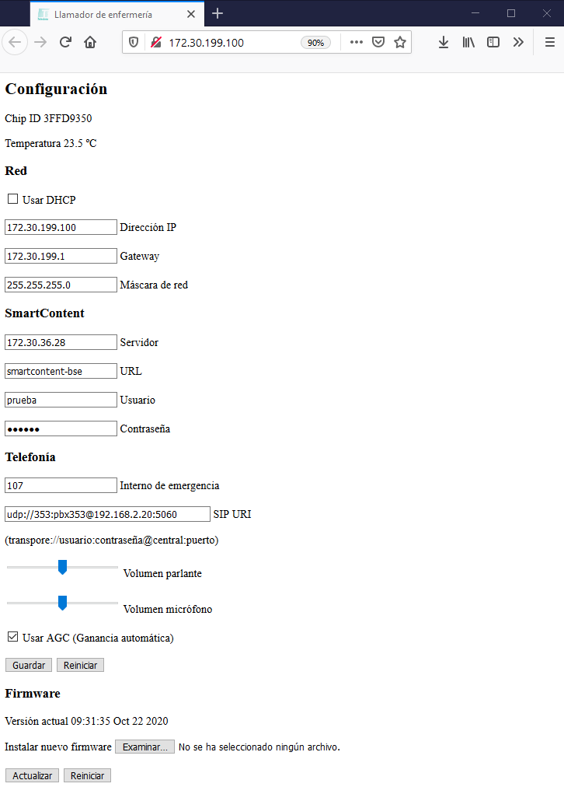

# Llamador

Llamador de enfermería basado en el chip ESP32 de Espressif.

Este nuevo llamador combina todas las funcionalidades en una sola placa.

# Conexiones



## Alimentación

El llamador puede ser alimentado por PoE (actualmente no funciona) o por una fuente externa de 5V 2A.

## Audio

Para conectar el micrófono se debe utilizar un cable coaxial.

La malla del cable coaxial debe ir al terminal negativo en la placa (el de la derecha) y se debe soldar al pin del micrófono que está conectado al cuerpo metálico del mismo.

La conexón del parlante no tiene polaridad, se pueden conectar en cualquier orden.

Se debe evitar que los contactos de los parlantes no se cortocircuiten y no entren en contacto con ninguno de los otros terminales del llamador.

## Mandos y pulsadores

Todos los pulsadores deben ser normalmente abiertos.

La activación de los mismos se detecta con la conexión a uno de los terminales GND.

Los mandos de las camas son digitales, por lo cual no son compatibles con los llamadores anteriores (los que tienen resistencias adentro).

En el conector del mando se encuentra marcado el pin 1, ese pin es el común a todos los botones y debe ser conectado a GND.
Los pines 2 y 3 corresponden a los botones verde y gris, estos dos pines deben ser conectados a los terminales CL1 o CL2.
Los pines 4 y 5 corresponden a los botones rojo y negro, estos dos pines deben ser conectados a los terminales BD1 o BD2.



Si el mando se conecta a través de un cable tipo rulo, se debe tener en cuenta que los conductores cambian de orientación en el cable. Los cables de color negro, verde y rojo en el mando se corresponden con los cables amarillo, rojo y verde en el extremo del llamador.



## Teclado

El teclado frontal se conectra a través de una placa auxiliar.

Esta placa auxiliar se conecta por la parte superior al teclado (se marca el pin 1 del teclado) y en la parte inferior tiene la conexión para la placa RFID (actualmente no soportada).



## Luces de dintel

Los terminales de las luces de dintel se comportan como una llave, cierra (dan continuidad) para encender el LED.

El llamador debe ser conectado del lado de baja tensión, es decir, a la salida de los transformadores de alimnetación de los LEDs.

Los transformadores de LED deben dejarse conectados a 220V.

Los terminales de las luces de dintel no tienen polaridad, se pueden conectar en cualquier orden y pueden activar tanto el lado positivo como el negativo del transformador.

# Configuración



La configuración del llamador se hace desde un explorador web.

Para que los cambios tengan efecto es necesario reiniciar el llamador.

Si no se conoce la IP del llamador o no se tiene acceso a la red, es posible conectarse por WiFi.

## Activar WiFi

El llamador debe estar sin ninguna acción pendiente, es decir, LEDs C1, C2 y B apagados.

Se debe mantener presionado el botón gris durante 4 segundos, hasta que los LEDs C1, C2 y B comiencen a parpadear.

En ese momento el llamador crea una red WiFi llamada ``Llamador_AP`` con la contraseña ``!t3l3d4t4577*``.

Para acceder a la interfaz web se debe visitar la IP ``192.168.4.1``.

Durante este tiempo el llamador dejará de responder a las entradas de los mandos.

Para salir de modo WiFi se puede presionar el botón gris o reiniciar el llamador desde la interfaz web.

# Compilar

```
cd esp-adf/esp-idf/
. ./export.sh
cd ../..
idf.py build
```

El archivo binario compilado queda en ``build/voip_app.bin``.

## Programar

Mantener presionado el botón BOOT y dar un toque a RESET para que la placa entre en modo de programación.

```
idf.py -p /dev/cu.usbserial-A50285BI erase_flash flash monitor
```

Donde ``/dev/cu.usbserial-A50285BI`` es el puerto serial.
