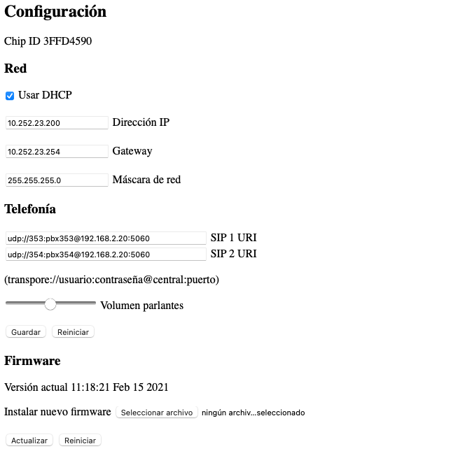

# Megáfono

Megáfono IP basado en el chip ESP32 de Espressif.

Cuenta con un amplificador estéreo MAX9736.

Se lo puede alimentar con fuentes de 8 a 22 V.

El amplificador puede entregar 10 W en 8 Ohms por canal, si es alimentado a 12 V.

La potencia máxima depende del voltaje de alimentación y la impedancia del parlante.

# Funcionamiento

El megáfono se conecta a la red WiFi ``edsmart`` y se registra en la central telefónica con dos internos diferentes ``SIP_1`` y ``SIP_2``.

La red WiFi a la que se conecta el megáfono está fija y no se puede cambiar. De ser necesario se puede modificar este comportamiento en el futuro.

Los LEDs ``LED1`` y ``LED2`` se encienden cuando el interno ``SIP_1`` y ``SIP_2`` son registrados satisfactoriamente.

Si alguno de los LEDs está apagado significa que el interno correspondiente no se pudo registrar en la central.

Cuando se llama a uno de los internos el megáfono contesta automáticamente y el LED correspondiente comienza a parpadear.

La salida de audio ``OUT_R`` corresponde al interno ``SIP_1``.

La salida de audio ``OUT_L`` corresponde al interno ``SIP_2``.

Cada canal tiene un potenciómetro ``IN_R`` e ``IN_L`` para regular el volumen por hardware. En sentido horario el volumen baja y en sentido anti horario sube.

El ajuste de volumen por software afecta a los dos canales a la vez.

Los pines GPIO 32 y 33 se encienden cuando ``SIP_1`` y ``SIP_2`` están con una llamada en curso, respectivamente. Estas señales pueden ser utilizadas para activar luces (mediante un módulo de relé), durante la llamada.

## Limitantes

El megáfono solo reproduce sonido, no tiene ninguna entrada de audio ni micrófono.

Solo uno de los internos se puede usar a la vez.

Si llega una llamada para uno de los internos y el otro ya está en uso, se espera a que se libere el otro interno antes de contestar la nueva llamada.

# Configuración

La configuración del megáfono se hace desde un explorador web.

Para que los cambios tengan efecto es necesario reiniciar el megáfono.

Si no se conoce la IP del megáfono o no se tiene acceso a la red, es posible conectarse por una red WiFi creada por el megáfono.

## Activar AP

Se debe reiniciar el megáfono, tocando el botón ``RESET``, mientras se mantiene presionado el botón ``BTN1``.

Los LEDs ``LED1`` y ``LED2`` comienzan a parpadear alternadamente para indicar que el AP está activado.

En ese momento el megáfono crea una red WiFi llamada ``Mega_AP`` con la contraseña ``!t3l3d4t4577*``.

Para acceder a la interfaz web se debe visitar la IP ``192.168.4.1``.

Para salir de modo AP se puede presionar el botón ``RESET`` o reiniciar el megáfono desde la interfaz web.
